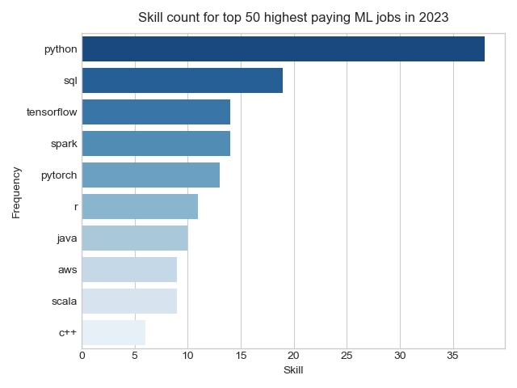
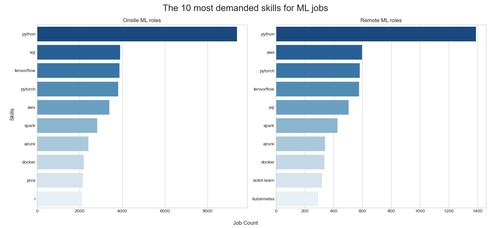
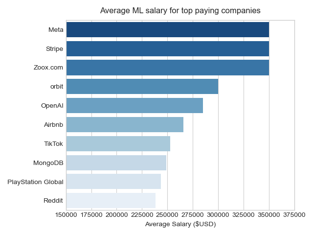
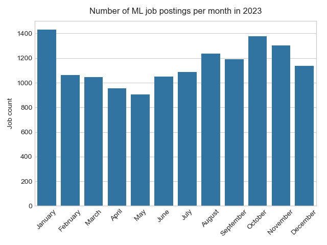
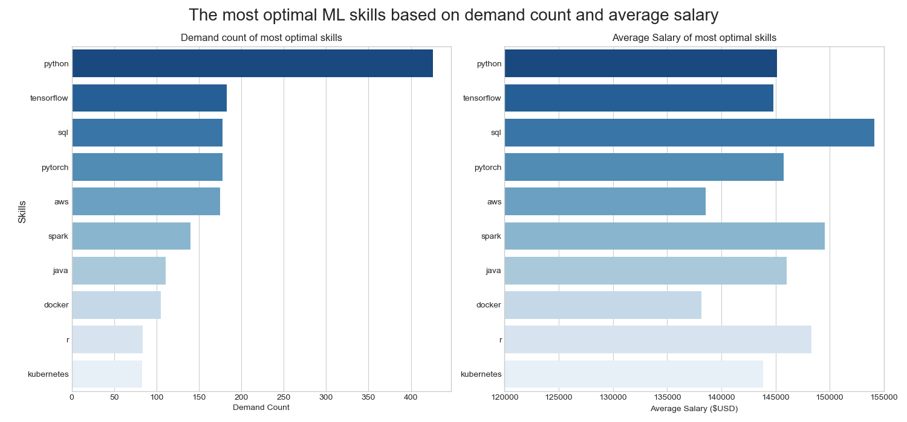

# README: SQL Queries for Machine Learning Job Analysis 📊💼
This repository contains SQL queries designed to analyze various aspects of machine learning (ML) job postings. These queries aim to provide insights into high-demand skills, top-paying roles, and optimal job search timing, as well as compare remote versus onsite job requirements. Each query is crafted to help job seekers and analysts understand market trends and make data-driven career decisions.

🔎 SQL Queries? Find them here [project_sql folder](/project_sql/)
# Background 📖
This is my first SQL project, undertaken as part of my journey to delve into the world of machine learning (ML). As someone who is keenly interested in pursuing a career in ML, I chose this project to not only learn SQL but also to investigate the skills and trends that are crucial for a successful ML career. By analyzing job postings and salaries, I aimed to gain insights into the most valuable skills and job market dynamics for ML roles.

Throughout this project, I focused on answering the following key questions:

1. **What are the top paying ML roles and the companies offering them?** 
2. **What are the top 10 skills required for the highest paying ML jobs?**
3. **What are the most in-demand skills for onsite versus remote ML jobs?**
4. **What is the average salary by skill for ML jobs?**
5. **Which companies pay the most on average to for ML role, including those offering health insurance?**
6. **What are the busiest times of the year for ML job postings?**
7. **What are the most optimal skills for ML roles based on high demand and high salary?**
# Tools I Used 🔨
In order to complete this project I used the following tools:
1. SQL
2. PostgreSQL
3. VS Code and Juptyer Notebook
4. Pandas, Seaborn and Matplotlib
4. Git & Github
# The Analysis 📈
Each query for this project aimed at investigating specific aspects of the ML job market. Here is how I went about answering each question. 
### Question 1: Investigating the highest paying roles 💰
For this query, I aimed to identify the **top 10 highest-paying machine learning (ML) roles** and the **companies offering them**. Key steps included:

- **Filtering**: Selected job postings related to ML roles by using the `ILIKE` command to perform a case-insensitive search for job titles containing "Machine Learning" or "ML." Additionally, I excluded postings with NULL salaries.
- **Joining**: Combined job postings using `LEFT JOIN` with the company dimension table to include company details.
- **Sorting**: Ordered the results by average salary in descending order to highlight the top-paying roles.
- **Limiting**: Limited the results to the top 10 highest-paying roles.

Why❓ This approach highlights the most lucrative opportunities for ML engineers and provides insights into high-paying positions in the industry.
```SQL
SELECT 
    companies.name AS company_name, 
    job_title,
    job_location,
    job_schedule_type, 
    salary_year_avg,
    job_posted_date 
FROM 
    job_postings_fact AS job_postings
LEFT JOIN company_dim AS companies ON job_postings.company_id = companies.company_id
WHERE 
    (job_title ILIKE '%Machine Learning%' 
    OR job_title ILIKE '% ML %')
    AND salary_year_avg IS NOT NULL 
ORDER BY 
    salary_year_avg DESC
LIMIT 10; 
```
#### Key Takeaways: Investigating the Highest Paying ML Roles

1. **Senior Management Focus**: Most of the highest-paying ML roles are senior management positions, such as Applied Data Science Leaders and Senior Managers, indicating a demand for experienced professionals in these high-level roles.

2. **Significant Salary Differences**: There is a considerable range in salaries among the top 10 roles, with the highest paying $425,000 and others around $300,000, highlighting a substantial disparity in compensation within the top-paying positions.

3. **Geographical Distribution**: Many of the highest-paying roles are located in San Francisco, CA, but there are also significant opportunities in other locations like Toronto and San Mateo, as well as for remote positions, showcasing diverse geographic options for high-paying ML jobs.

| Company Name | Job Title                                                | Job Location      | Job Schedule Type | Salary (Year Avg) | Job Posted Date       |
|--------------|----------------------------------------------------------|-------------------|-------------------|-------------------|-----------------------|
| Glocomms     | Applied Data Science or Machine Learning Leader         | San Francisco, CA | Full-time         | $425,000          | 2023-10-06 18:02:32   |
| Airbnb       | Senior Staff Tech Lead, Core ML Data Science            | San Francisco, CA | Full-time         | $350,000          | 2023-06-15 13:19:24   |
| Stripe       | Data Science Manager, Growth Intelligence and Machine Learning | Toronto, OH       | Full-time         | $350,000          | 2023-07-12 12:04:47   |
| Pinterest    | Senior Manager, Data Science - Science and Machine Learning | San Francisco, CA | Full-time         | $350,000          | 2023-04-19 08:04:16   |
| Meta         | Data Scientist, Machine Learning                         | Menlo Park, CA    | Full-time         | $350,000          | 2023-01-04 01:32:23   |
| Zoox.com     | Senior/Staff ML Validation Data Scientist - Perception    | San Mateo, CA     | Full-time         | $350,000          | 2023-11-08 11:23:35   |
| Harnham      | Senior Machine Learning Engineer                         | Anywhere          | Full-time         | $325,000          | 2023-02-21 22:37:17   |
| Storm5       | Principal Machine Learning Engineer                      | Anywhere          | Full-time         | $325,000          | 2023-11-24 14:25:28   |
| orbit        | Machine Learning Engineer                                | Anywhere          | Full-time         | $300,000          | 2023-11-24 18:02:30   |
| OpenAI       | Research Scientist, Machine Learning                     | San Francisco, CA | Full-time         | $285,000          | 2023-01-31 12:02:49   |


### Question 2: What are the top 10 skills required for the highest paying ML jobs?
This query aims to identify the top 10 most frequently mentioned skills in the highest-paying machine learning (ML) job postings. To achieve this, I focused on analyzing the top 50 highest-paying ML job postings. Key steps included:

- **Subquery**: Used a subquery wherein I selected the top 50 ML job and then ordered the results by salary in descending order to capture the highest-paying jobs.
- **Joining**: Joined the selected top-paying jobs with the relevant skills data by matching job IDs with skill IDs using `INNER JOIN`.
- **Grouping and Counting**: Grouped the results by each skill and counted the number of job postings that mentioned each skill.

Why❓ This query helps identify the most valuable skills associated with the highest-paying ML jobs, providing insights for job seekers on which skills to prioritize.
```SQL
SELECT 
    skills.skills,
    COUNT(skills) AS skill_count 
FROM (
    SELECT 
        job_id
    FROM 
        job_postings_fact AS job_postings
    WHERE 
        (job_title ILIKE '%Machine Learning%' 
        OR job_title ILIKE '% ML %') 
        AND salary_year_avg IS NOT NULL 
    ORDER BY salary_year_avg DESC 
    LIMIT 50 
) AS top_ML_jobs
INNER JOIN skills_job_dim AS skills_to_job ON top_ML_jobs.job_id = skills_to_job.job_id
INNER JOIN skills_dim AS skills ON skills_to_job.skill_id = skills.skill_id
WHERE skills.skills IS NOT NULL 
GROUP BY skills
ORDER BY skill_count DESC 
LIMIT 10;
```
#### Key Takeaways from Query 2:

1. **Python is Essential**: Python is the most frequently required skill for high-paying ML jobs, emphasizing its critical role in the field.

2. **SQL and ML Frameworks**: Skills in SQL, TensorFlow, Spark, and PyTorch are highly valued, highlighting the importance of data management and machine learning frameworks.

3. **Diverse Skills**: Proficiency in additional programming languages (e.g., R, Java) and cloud platforms (e.g., AWS) can further boost job prospects in top-paying ML roles.



 

### Question 3: What are the most in-demand skills for onsite versus remote ML jobs?
This query investigates the most in-demand skills across all machine learning (ML) jobs and compares whether the required skills differ for remote versus onsite positions. The goal is to provide insights into the most sought-after skills for ML roles, helping job seekers tailor their learning.
  
- **Onsite Jobs**: Created a CTE (`in_demand_skills_o`) to identify the top 10 most frequently mentioned skills in onsite ML jobs by filtering out remote jobs (`job_location <> 'Anywhere'`).

- **Remote Jobs**: Created a second CTE (`in_demand_skills_r`) to focus on the top 10 skills in remote ML jobs by selecting only those with `job_location = 'Anywhere'`.

- **Grouping and Counting**: For both CTEs, grouped the results by skill and counted the number of job postings mentioning each skill.

- **Comparison**: The query results allow for a comparison of in-demand skills between remote and onsite ML positions, offering strategic insights for career development.
```SQL
WITH in_demand_skills_o AS (
    SELECT 
        skills.skills,
        COUNT(job_postings.job_id) AS demand_count 
    FROM job_postings_fact AS job_postings
    LEFT JOIN skills_job_dim AS skills_to_job ON job_postings.job_id = skills_to_job.job_id
    LEFT JOIN skills_dim AS skills ON skills_to_job.skill_id = skills.skill_id
    WHERE 
        (job_title ILIKE '%Machine Learning%' 
        OR job_title ILIKE '% ML %') 
        AND job_location <> 'Anywhere' -- Exclude remote jobs
    GROUP BY skills.skills
    ORDER BY demand_count DESC
    LIMIT 10
)
SELECT * 
FROM in_demand_skills_o;

WITH in_demand_skills_r AS (
    SELECT 
        skills.skills,
        COUNT(job_postings.job_id) AS demand_count
    FROM job_postings_fact AS job_postings
    LEFT JOIN skills_job_dim AS skills_to_job ON job_postings.job_id = skills_to_job.job_id
    LEFT JOIN skills_dim AS skills ON skills_to_job.skill_id = skills.skill_id
    WHERE 
        (job_title ILIKE '%Machine Learning%' 
        OR job_title ILIKE '% ML %') 
        AND job_location = 'Anywhere' 
    GROUP BY skills.skills
    ORDER BY demand_count DESC
    LIMIT 10
)
SELECT *
FROM in_demand_skills_r;
```
#### Key Takeaways: Most In-Demand Skills for Onsite vs. Remote ML Jobs
1. **Dominance of Python**: Python is the most in-demand skill for both onsite and remote ML jobs, but its demand is significantly higher for onsite positions, reflecting its central role in ML across various job types.

2. **High Demand for Core Technologies Onsite**: Onsite roles show a strong demand for a broad range of core ML technologies, including TensorFlow, PyTorch, and SQL, with Python and AWS also highly sought after.

3. **Remote Job Skill Focus**: For remote ML roles, while Python remains the top skill, there's a notable emphasis on cloud technologies like AWS and containerization tools like Docker and Kubernetes, which are more frequently required in remote settings.



### Question 4: What is the average salary by skill for ML jobs?
This query calculates the average salary for skills required in machine learning (ML) jobs, focusing on skills mentioned in at least 50 job postings to ensure reliable data.

- **Grouping and Counting**: Grouped by skill and calculated the rounded average salary for each. Used the `HAVING` clause to ensure only skills with at least 50 job postings were included.

The results help job seekers identify the most lucrative skills to prioritize in their ML careers.
```SQL
SELECT
    skills.skills,
    ROUND(AVG(salary_year_avg), 0) AS avg_salary,
    COUNT(job_postings.job_id) AS job_count
FROM job_postings_fact AS job_postings
INNER JOIN skills_job_dim AS skills_to_job ON job_postings.job_id = skills_to_job.job_id
INNER JOIN skills_dim AS skills ON skills_to_job.skill_id = skills.skill_id
WHERE
    (job_title ILIKE '%Machine Learning%' 
    OR job_title ILIKE '% ML %') 
    AND salary_year_avg IS NOT NULL
GROUP BY skills.skills
HAVING COUNT(job_postings.job_id) >= 50 
ORDER BY avg_salary DESC
LIMIT 10
```
#### Key Takeaways: Average Salary by Skill for ML Jobs

1. **Highest Salaries for Specialized Skills**: Skills such as SQL, Scala, and Hadoop offer the highest average salaries, exceeding $150,000, indicating that these specialized skills are highly valued in the ML job market.

2. **Python and PyTorch**: Despite having a slightly lower average salary compared to some specialized skills, Python and PyTorch are still among the top earners. Python remains crucial due to its widespread use, while PyTorch is also well-compensated.

| Skills   | Avg Salary | Job Count |
|----------|------------|-----------|
| SQL      | 154,133    | 178       |
| Scala    | 154,010    | 56        |
| Hadoop   | 153,957    | 54        |
| Spark    | 149,541    | 140       |
| R        | 148,334    | 84        |
| C++      | 146,333    | 57        |
| Airflow  | 146,174    | 66        |
| Java     | 146,055    | 111       |
| PyTorch  | 145,761    | 178       |
| Python   | 145,148    | 426       |


### Question 5: Which companies pay the most on average to for ML role, including those offering health insurance?
This query identifies the top 10 companies that offer the highest average salaries to machine learning (ML) workers, specifically focusing on those that provide health insurance. By filtering for companies that combine competitive pay with health benefits, the results give job seekers strategic insights into the best employers to target in their job search.
```SQL
SELECT 
    company_dim.name AS company_name,
    ROUND(AVG(salary_year_avg),0) AS avg_salary_company
FROM (
    SELECT *
    FROM job_postings_fact AS job_postings
    WHERE 
        (job_title ILIKE '%Machine Learning%' 
        OR job_title ILIKE '% ML %') 
        AND (salary_year_avg IS NOT NULL) 
        AND job_health_insurance IS TRUE 
) AS ML_jobs
LEFT JOIN company_dim ON ML_jobs.company_id = company_dim.company_id
GROUP BY company_name
ORDER BY avg_salary_company DESC
LIMIT 10
```
#### Key Takeaways: Top-Paying Companies for ML Roles with Health Insurance
1. **Wide Salary Range**: The average salaries for the top companies vary, from $350,000 at the highest end to $238,250 at the lowest, indicating a salaries at top paying companies can vary massively.



### Question 6: What are the busiest times of the year for ML job postings?
This query analyzes the distribution of machine learning (ML) job postings across different months to identify the periods with the highest job posting activity. The results are grouped by month and ordered by the number of job postings, helping job seekers understand the best times of the year to focus their job search.
```SQL
SELECT 
    EXTRACT(MONTH FROM job_posted_date) AS month_posted, 
    COUNT(job_id) AS jobs_posted 
FROM job_postings_fact AS job_postings
WHERE 
     (job_title ILIKE '%Machine Learning%' 
    OR job_title ILIKE '% ML %')
GROUP BY 
    month_posted
ORDER BY jobs_posted DESC;
```
#### Key Takeaways: Busiest Times for ML Job Postings
1. **Peak Months**: January and October have the highest number of ML job postings.
2. **Stable Demand**: Posting activity remains high throughout most of the year.
3. **Lower Activity in Spring and Christmas period**: Fewer job postings occur in spring months and over the Christmas period.


### Question 7: What are the most optimal skills for ML roles based on high demand and high salary?
This query identifies the top 10 machine learning (ML) skills that offer both high demand and high average salaries. By filtering for skills mentioned in at least 50 job postings, the results highlight key skills that are both lucrative and in-demand, providing valuable insights for career development in the ML field.
```SQL
SELECT
    skills_dim.skills, 
    COUNT(skills_job_dim.job_id) AS demand_count,
    ROUND(AVG(job_postings.salary_year_avg),0) AS avg_salary
FROM job_postings_fact AS job_postings
INNER JOIN skills_job_dim ON job_postings.job_id = skills_job_dim.job_id
INNER JOIN skills_dim ON skills_job_dim.skill_id = skills_dim.skill_id
WHERE 
    (job_title ILIKE '%Machine Learning%' 
    OR job_title ILIKE '% ML %') 
    AND salary_year_avg IS NOT NULL
GROUP BY skills_dim.skill_id
HAVING COUNT(skills_job_dim.job_id) >= 50 
ORDER BY 
    demand_count DESC,
    avg_salary DESC
LIMIT 10
```
#### Key Takeaways: Optimal Skills for ML Roles

1. **Top Skill**: Python leads with the highest demand and salary, averaging $145,148 with 426 job postings.
2. **High Demand and Salary**: Skills like TensorFlow and PyTorch are highly demanded, with average salaries around $144,818 and $145,761, respectively.
3. **Well-Paid Skills**: SQL, Spark, and Java also offer high salaries, averaging between $138,532 and $154,133, making them valuable skills in the ML field.


# Conclusion of Results
## What I Learned 💡

This project provided me with valuable insights into the machine learning (ML) job market. Here are the key takeaways:

1. **High Demand for Python 🐍**: Python is overwhelmingly the most sought-after skill in high-paying ML roles. Its versatility and wide application in ML projects make it essential for anyone looking to advance in this field.

2. **Importance of Specialized Skills 🎯**: Skills like SQL, TensorFlow, and PyTorch are not only highly demanded but also come with higher salaries. Specializing in these areas can significantly boost your earning potential.

3. **Geographical Trends 🌍**: There is a noticeable concentration of high-paying ML jobs in tech hubs like San Francisco, CA, though there are also lucrative opportunities in other locations and remote roles. Being open to relocation or remote work can expand your job prospects.

4. **Seasonal Job Posting Trends 📅**: The ML job market sees peak activity in January and October, while there are quieter periods in spring and during the Christmas season. Timing your job search can improve your chances of finding opportunities.

5. **Onsite vs. Remote Skills Comparison 🏢💻**: While Python remains crucial for both onsite and remote roles, there is a distinct emphasis on cloud technologies and containerization tools like Docker and Kubernetes for remote positions. Tailoring your skill set to these demands can give you an edge in remote job applications.

## What I Learned 💡
This project has been an incredibly valuable learning experience, offering me a deeper understanding of the ML job market and honing my technical skills. Here’s what I gained:
1. **🧩 Mastering Complex Queries**: I developed expertise in crafting complex SQL queries using subqueries and Common Table Expressions (CTEs). I became adept at utilizing the `JOIN` function to merge multiple tables, enabling me to extract and analyze crucial information effectively.

2. **📊 Data Aggregation Skills**: I gained proficiency in using the `GROUP BY` function and various aggregate functions such as `COUNT` and `AVG`. These tools were essential for summarizing and interpreting large datasets, allowing me to derive meaningful insights from complex information.

3. **🧑‍💻 Efficient Project Management**: I learned to manage my code effectively using Git within VS Code. This included mastering essential version control commands such as `push` and `pull`, which streamlined collaboration and ensured that changes were accurately tracked and integrated.


